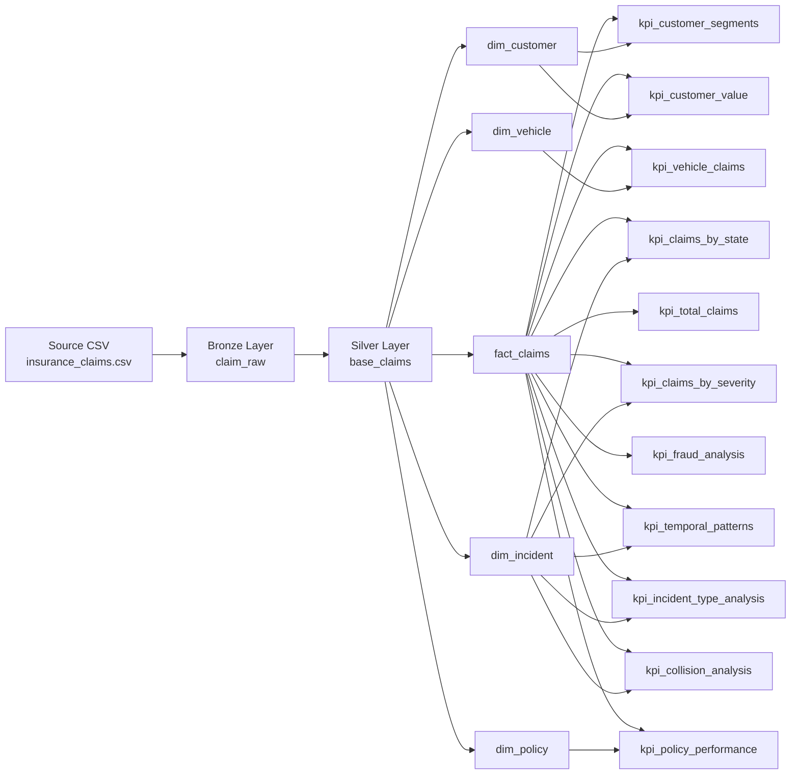
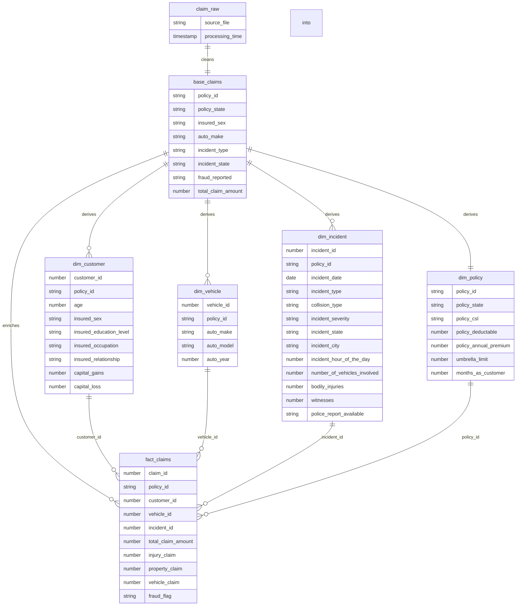

# Insurance Claims Analytics Lakehouse

> A corporate-grade insurance claims data platform built to transform raw policy and incident data into decision-ready intelligence.


An end-to-end insurance claims analytics pipeline built on a bronze-silver-gold architecture. The project ingests raw claims data, standardizes it into a reusable star schema, and publishes business-ready KPI views for underwriting, fraud oversight, customer analysis, and operational reporting.

## Project Snapshot

| Dimension | Details |
| --- | --- |
| Domain | Insurance claims analytics |
| Architecture | Bronze - Silver - Gold |
| Core Modeling Pattern | Star schema |
| Serving Layer | KPI materialized views |
| Primary Outcomes | Fraud visibility, loss analysis, customer profiling, policy performance |

## Table of Contents

- [Executive Summary](#executive-summary)
- [Why This Matters](#why-this-matters)
- [Architecture Overview](#architecture-overview)
- [ER Diagram](#er-diagram)
- [Data Pipeline](#data-pipeline)
- [KPI Portfolio](#kpi-portfolio)
- [Executive Outcomes](#executive-outcomes)
- [Repository Structure](#repository-structure)
- [Implementation Notes](#implementation-notes)
- [What Makes It Strong](#what-makes-it-strong)
- [Business Value](#business-value)

## Executive Summary

This solution turns a single insurance claims dataset into an analytics-ready model with three clear layers:

- Bronze captures the raw source with lightweight normalization and ingestion metadata.
- Silver reshapes the data into a dimensional model with customer, vehicle, incident, policy, and fact tables.
- Gold publishes focused KPI materialized views that answer the most important business questions immediately.

The result is a structured foundation for executive dashboards, risk monitoring, and claims intelligence.

## Why This Matters

This project is designed to support the questions leadership actually asks:

- Where are losses concentrated?
- Which customer, policy, vehicle, and incident segments are the most risky?
- How often does fraud appear, and what patterns precede it?
- Which business segments create the highest claims pressure relative to premium intake?

By separating ingestion, conformance, and reporting, the pipeline makes the answers traceable, reusable, and easy to scale.

## Architecture Overview



## ER Diagram



## Data Pipeline

### Bronze

The bronze layer ingests the raw CSV from `/Volumes/workspace/default/project/insurance_claims.csv`, standardizes column names, and adds operational metadata:

- `processing_time` records when the pipeline processed the row.
- `source_file` preserves data provenance.
- Column names are normalized by trimming spaces and replacing spaces or hyphens with underscores.

### Bronze Output

The bronze table provides a governed landing zone for the source data and is the first checkpoint in the pipeline before any dimensional modeling begins.

### Silver

The silver layer creates the reusable analytical model:

- `base_claims` acts as the source-of-truth cleaned table.
- `dim_customer` captures insured demographic and financial attributes.
- `dim_vehicle` captures vehicle make, model, and year.
- `dim_incident` captures incident timing, type, severity, location, and police-report context.
- `dim_policy` captures coverage, deductibles, premium, and tenure.
- `fact_claims` links the dimensions and preserves claim measures such as claim amount, injury claim, property claim, vehicle claim, and fraud flag.

### Gold

The gold layer produces business-facing materialized views designed for reporting and analysis:

- `kpi_total_claims` for enterprise-wide claim volume and total claim amount.
- `kpi_claims_by_state` for geographic distribution, severity mix, and fraud rate.
- `kpi_claims_by_severity` for severity-driven damage and injury analysis.
- `kpi_temporal_patterns` for hourly, daily, and monthly claim behavior.
- `kpi_policy_performance` for loss ratio, premium efficiency, and deductible segmentation.
- `kpi_incident_type_analysis` for collision and incident pattern analysis.
- `kpi_fraud_analysis` for fraud prevalence and fraudulent claim characteristics.
- `kpi_customer_value` for retention, lifetime premium, and loss ratio insights.
- `kpi_customer_segments` for demographic segmentation and risk profiling.
- `kpi_collision_analysis` for collision impact, injuries, and police-report behavior.
- `kpi_vehicle_claims` for vehicle age, make, model, and damage risk.

## KPI Portfolio

| View | Primary Question Answered |
| --- | --- |
| `kpi_total_claims` | What is the total claims count and total paid amount? |
| `kpi_claims_by_state` | Which states generate the most claims, loss, and fraud? |
| `kpi_claims_by_severity` | How do severity levels influence injuries and damage types? |
| `kpi_temporal_patterns` | When do claims occur most often? |
| `kpi_policy_performance` | Which policy segments generate the highest loss ratios? |
| `kpi_incident_type_analysis` | Which incident and collision types are most costly? |
| `kpi_fraud_analysis` | What is the fraud rate and how does fraud differ from legitimate claims? |
| `kpi_customer_value` | Which customer segments produce the best or worst lifetime economics? |
| `kpi_customer_segments` | Which demographic segments are most exposed to claim and fraud risk? |
| `kpi_collision_analysis` | How do collision patterns affect injuries, police reports, and fraud? |
| `kpi_vehicle_claims` | Which vehicle categories drive the largest claim losses? |

## Executive Outcomes

- Faster claims monitoring through pre-aggregated KPI views.
- Better underwriting and portfolio decisions through policy and customer segmentation.
- Clearer fraud detection patterns through consistent fraud-rate calculations.
- Reduced model ambiguity by standardizing the source into conformed dimensions and a single fact table.

## Repository Structure

```text
Insurance_claims/
  transformations/
    bronze/
      insurance_claims.py
    silver/
      star_schema.py
    gold/
      kpi_claims_by_severity.sql
      kpi_claims_by_state.sql
      kpi_collision_analysis.sql
      kpi_customer_segments.sql
      kpi_customer_value.sql
      kpi_fraud_analysis.sql
      kpi_incident_type_analysis.sql
      kpi_policy_performance.sql
      kpi_temporal_patterns.sql
      kpi_total_claims.sql
      kpi_vehicle_claims.sql
```

## Delivery Highlights

- A clean bronze-to-gold flow that is easy to explain to both technical and business audiences.
- A dimensional model that supports both analytical joins and focused KPI publishing.
- A metrics layer that is already aligned to common insurance leadership questions.
- A documentation-first presentation that can stand on its own in a portfolio, interview, or stakeholder review.

## Implementation Notes

- The bronze ingestion is implemented with Delta Live Tables.
- The silver layer uses surrogate keys for analytical joins while keeping `policy_id` as the business anchor.
- The gold layer is intentionally metric-focused, with each materialized view designed to power a specific business conversation.
- The design keeps raw ingestion, conformed modeling, and reporting separated so changes in one layer do not ripple unnecessarily into the others.

## What Makes It Strong

- The model is intentionally simple to understand but rich enough for serious analytics.
- The gold views cover both operational monitoring and strategic analysis.
- The diagrams map directly to the code, so the README doubles as a reliable technical handoff.

## Business Value

This architecture gives stakeholders three things at once: traceable ingestion, a consistent analytics model, and a ready-made KPI layer for dashboarding. It is suitable for executive reporting, claims triage, fraud monitoring, and customer profitability analysis.
